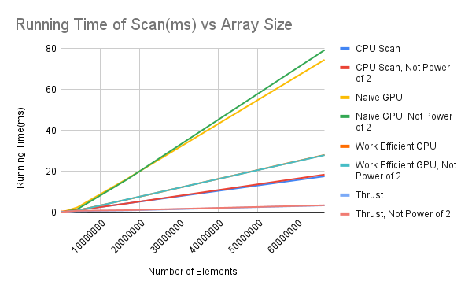

CUDA Stream Compaction
======================

**University of Pennsylvania, CIS 565: GPU Programming and Architecture, Project 2**

* Daniel Gerhardt
  * https://www.linkedin.com/in/daniel-gerhardt-bb012722b/
* Tested on: Windows 23H2, AMD Ryzen 9 7940HS @ 4GHz 32GB, RTX 4070 8 GB (Personal Laptop)

### Stream Compaction

## Description

Stream compaction is the process of taking an array and removing unwanted elements from it. In this project, that means removing 0s from an array. There are five different implementations being compared here. 

1. Compaction without scan on the CPU. This runs a simple O(n) for loop that checks if the input element is 0, and if it is not, adds it to the output.
2. Compaction with scan on the CPU. Scan is a "prefix sum" algorithm that outputs an array that contains at location i the sum of all elements up to element i. Scan can be used for compaction by creating an array of 1s and 0s that is parallel to the original input data, where a 1 represents the element at the same index is going to be in the output, and 0 represents the element is not going to be in the output. You can then accumulate the number of 1s to get an array that increases on the elements that should be contained in the output, and the value of the array at the element in the output is the final index of that element in the output.
3. Naive compaction on the GPU. The following figure shows what the approach looks like:

 By adding in parallel and only having a logarithmic number of iterations, this algorithm reduces the overall complexity to O(logn). But, there are O(nlogn) adds since in the worst case there are O(n) adds per iteration. The work efficient solutions seeks to reduce this factor.
4. Work efficient compaction on the GPU. The following figure shows what the approach looks like: 
This is a much less intuitive approach. The algorithm involves 2 phases, the upsweep and the downsweep. The upsweep is the same as the parallel reduction from method 3, except the algorithm occurs "in place" on the input data. Then, by treating the array as a tree and doing some clever summation, the amount of work can be reduced by filtering the sums down the "tree". This is done by setting the "root" -- the last element -- to zero, and then at each pass, giving each left child the parent's value, and setting the right child to the sum of the previous left child’s value and the parent's value. The upsweep has O(n) adds and the downsweep has O(n) adds and O(n) swaps, which reduces the complexity from method 3.
5. A wrapper for thrust's implementation of stream compaction for the sake of performance comparison.

# Sample Output

## Performance Analysis

# Charts

The following is a chart displaying how running time of the numerous methods changes with input size in the scan algorithm.

The following is a chart displaying how running time of the numerous methods changes with input size in the compaction algorithm.

# Observations

Observations on power-of-two length. In scan the non-power of two work efficient algorithm had a larger difference in performance over the power of two input. This is likely because the overhead of padding zeroes increases as size increases. The same is not true of the compaction algorithms, likely because the main bottleneck of that algorithm is the global memory reads, which are present even if the input is a power of 2. 

# Investigation of Thrust using NSight Compute