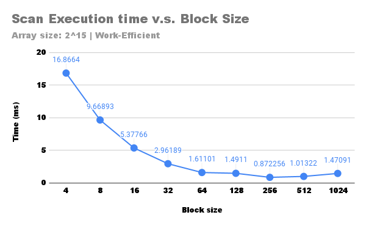

CUDA Stream Compaction
======================

**University of Pennsylvania, CIS 565: GPU Programming and Architecture, Project 2**

* Yinuo (Travis) Xie
  * [LinkedIn](https://www.linkedin.com/in/yinuotxie/)
* Tested on: Windows 10, 12th Gen Intel(R) Core(TM) i7-12700 @ 2.10 GHz, 16GB, NVIDIA GeForce RTX 3060 Ti (Personal Computer)

# CUDA Scan  & Stream Compaction

## Table of Contents
* [Overview](#overview)
* [Prefix Sum Scan](#prefix-sum-scan)
  * [What is Prefix Sum Scan?](#what-is-prefix-sum-scan)
  * [Implementation](#implementation)
    * [CPU Scan](#cpu-scan)
    * [Naive GPU Scan](#naive-gpu-scan)
    * [Work-Efficient GPU Scan](#work-efficient-gpu-scan)
      * [Up-Sweep](#up-sweep)
      * [Down-Sweep](#down-sweep)
      * [Dynamic Grid Sizing in Work-Efficient Scan](#dynamic-grid-sizing-in-work-efficient-scan)
    * [Work-Efficient GPU Scan with Shared Memory](#work-efficient-gpu-scan-with-shared-memory)
    * [Thrust Scan](#thrust-scan)
* [Stream Compaction](#stream-compaction)
  * [What is Stream Compaction?](#what-is-stream-compaction)
  * [Implementation](#implementation-1)
    * [CPU Compact without Scan](#cpu-compact-without-scan)
    * [CPU Compact with Scan](#cpu-compact-with-scan)
    * [Work-Efficient Compact](#work-efficient-compact)
* [Performance Analysis](#performance-analysis)
  * [Performance Analysis on Different Scan Algorithms](#performance-analysis-on-different-scan-algorithms)
  * [Performance Analysis on Different Block Sizes](#performance-analysis-on-different-block-sizes)
  * [Performance Analysis on Different Compact Algorithms](#performance-analysis-on-different-compact-algorithms)
  * [Nsight Timeline for Thrust Scan](#nsight-timeline-for-thrust-scan)
* [Blooper](#blooper)
* [Output](#output)

## Overview

This project presents various algorithms tailored to handle two essential operations using CUDA: prefix sum scan and stream compaction.

## Prefix Sum Scan

### What is Prefix Sum Scan?

Imagine you're working with a digital painting program. Each brush stroke you make on the canvas is recorded in a list, and each stroke has a certain amount of memory it occupies. The prefix sum scan is like calculating the total memory used up to each brush stroke. This is helpful because if you want to 'undo' or 'replay' your strokes up to a certain point, the program knows exactly how much memory it needs to access. This technique isn't only about recording brush strokes; it's a cornerstone in computer graphics, aiding in tasks such as determining how much memory to allocate for rendering scenes.

To illustrate the prefix sum scan, consider the following array:

```
[3, 1, 7, 0, 4, 1, 6, 3]
```

The inclusive prefix sum scan of this array is:

```
[0, 3, 4, 11, 11, 15, 16, 22]
```

The exclusive prefix sum scan of this array is:
```
[3, 4, 11, 11, 15, 16, 22, 25]
```

### Implementation

The prefix sum scan implemented in this project is an exclusive scan. This means that the result at each position in the output array does not include the input value at that position. The project encompasses five different approaches:

* CPU Scan
* Naive GPU Scan
* Work-Efficient GPU Scan
* Work-Efficient GPU Scan with Shared Memory
* Thrust Scan

**Note**: For all the scans, the input array size is assumed to be a power of 2. If not, the array is padded with zeros to the nearest power of 2.

#### CPU Scan

The CPU scan is realized within the `StreamCompaction::CPU::scan` function. It is based on a straightforward for-loop that iterates through the array, adding the value of the preceding element to the current one. The initial element is preset to 0.

#### Naive GPU Scan

In the Naive GPU scan `StreamCompaction::Naive::scan`, parallelism is harnessed to speed up the prefix sum calculation. Instead of processing elements one by one, the algorithm leverages the GPU's capability to process multiple elements simultaneously, reducing the time required to compute the scan. The images below illustrate the process of the naive GPU scan.


#### Work-Efficient GPU Scan

The Work-Efficient GPU Scan `StreamCompaction:Efficient::scan` is optimized to use fewer operations than the naive approach. By organizing the computations in a specific structure and eliminating redundant calculations, this method can achieve faster computation times on the GPU. The work-efficient GPU scan involves two pivotal steps:

* Up-Sweep (Parallel Reduction)
* Down-Sweep 

##### Up-Sweep

The Up-Sweep phase, also known as Parallel Reduction, is the first step of the Work-Efficient scan. In this phase, the algorithm works from the bottom of the data structure upwards, combining pairs of elements and propagating their sums up the tree. The outcome of this step is a balanced binary tree with partial sums, with the total sum of all elements at the root. The image below illustrates the process of the up-sweep.


##### Down-Sweep

The Down-Sweep phase begins from the top of the constructed tree and works its way downwards. Starting with the root set to zero, the algorithm traverses the tree, swapping and accumulating values to generate the prefix sum for each element. The result of this phase is the desired prefix sum array, constructed in a more efficient manner than the naive approach. The image below illustrates the process of the down-sweep.


##### Dynamic Grid Sizing in Work-Efficient Scan

To optimize resource usage and enhance performance, the work-efficient scan incorporates dynamic grid sizing. This adaptive approach ensures that the number of blocks needed is determined at each level of computation.

As the algorithm ascends the tree, there's a noticeable reduction in the number of elements participating in calculations. This decrement in element count implies that fewer blocks are needed to handle the processing. Consequently, by dynamically adjusting the grid size based on the current computation level, the algorithm ensures efficient utilization of GPU resources, thereby maximizing the occupancy ratio. This strategy not only improves computational speed but also ensures optimal resource usage throughout the scanning process.

#### Work-Efficient GPU Scan with Shared Memory

Building upon the Work-Efficient GPU Scan, the `StreamCompaction::Efficient::scanShared` approach taps into shared memory to yield enhanced performance. Shared memory in GPUs offers a speed advantage over global memory, making data fetches quicker when the required data resides locally.

The process to exploit this memory advantage is multi-faceted:

1. **Block Scan**: Initially, the algorithm executes a block scan on each block within the array. Here, the prefix sum is computed for elements within individual blocks using shared memory, ensuring faster data access and computations.

2. **Storing Block Sums**: After computing the prefix sums for individual blocks, the algorithm saves the total sum of each block into an array called `blockSums`.

3. **Scanning Block Sums**: A prefix sum scan is then performed on the `blockSums` array. Interestingly, this step can recursively apply `scanShared` if the `blockSums` array is large. This recursive strategy takes advantage of shared memory at multiple levels, optimizing the computation further. However, due to simplicity, this project did not implement the recursive approach.

4. **Adding Block Sums to Elements**: Finally, the corresponding block sum from the `blockSums` array is added to every element within a block. This step integrates the computed offsets, resulting in the final prefix sum array for the entire dataset.

**Example**:
Imagine an array: `[3, 1, 7, 0, 4, 1, 6, 3]`. When broken into blocks of size 4:
* Block 1: `[3, 1, 7, 0]`
* Block 2: `[4, 1, 6, 3]`

After block scan, we may get:
* Block 1: `[0, 3, 4, 11]`
* Block 2: `[0, 4, 5, 11]`

The `blockSums` array will be: `[11, 11]`. Applying `scanShared` on `blockSums` gives `[0, 11]`.

Finally, adding block sums to elements:
* Block 1: remains `[0, 3, 4, 11]`
* Block 2: `[11, 15, 16, 22]`

The final output array becomes: `[0, 3, 4, 11, 11, 15, 16, 22]`.

By dividing the task into blocks and using shared memory to handle intra-block computations, `StreamCompaction::Efficient::scanShared` manages to achieve faster computation times and more efficient memory usage, especially for large datasets.


#### Thrust Scan

Thrust is a CUDA library that offers a collection of efficient parallel primitives. In this project, the Thrust library's built-in scan function is used. It provides a highly optimized and robust implementation of the prefix sum scan, ensuring both speed and accuracy.

## Stream Compaction

### What is Stream Compaction?

Consider a 3D scene in a video game with various objects: trees, buildings, characters, and some 'invisible' objects that the player shouldn't see. Stream compaction is akin to a smart camera that only focuses on the visible objects and ignores the invisible ones, thus only rendering what's essential. In our project, we likened this to removing zeros from a list, similar to how the camera filters out unimportant details. Such an approach is crucial in computer graphics to ensure scenes are rendered efficiently, providing smoother gameplay or more detailed visual effects. It is also useful in applications like path tracing, collision detection, and sparse matrix compression.

**Example**:
Consider an array: `[3, 0, 1, 0, 0, 2, 0, 0]`. The stream compacted array is `[3, 1, 2]`.

### Implementation

The stream compaction implemented in this project encompasses three approaches:

* CPU Compact without Scan
* CPU Compact with Scan
* Work-Efficient Compact

#### CPU Compact without Scan

The CPU compact without scan, represented by the function `StreamCompaction::CPU::compactWithoutScan`, adopts a direct method. It marches through the input array, cherry-picking non-zero elements to append to the output array. An internal counter keeps tabs on the number of non-zero elements, which ultimately dictates the dimensions of the output array. Below is a visual representation of the CPU compact without scan process.


#### CPU Compact with Scan

For `StreamCompaction::CPU::compactWithScan`, the approach is more intricate yet optimized. The methodology unfolds in three primary stages:

1. **Boolean Mask Creation**: A boolean array is first generated. Each slot in this array is tagged with a '1' if the corresponding element in the input array isn't zero. Otherwise, it's marked with a '0'.
2. **Applying CPU Scan**: This boolean array then undergoes a CPU scan, which churns out the indices for the non-zero elements.
3. **Population of Output Array**: Using the indices harvested from the scan, non-zero elements are transposed to the output array in their appropriate order.

The accompanying image furnishes a clearer picture of the CPU compact with scan modus operandi.


#### Work-Efficient Compact

The `StreamCompaction::Efficient::compact` function champions a work-efficient approach. This method is designed to harness the GPU's parallel processing prowess to its fullest, ensuring minimal redundancy in operations. By organizing data in a structured manner and pruning unnecessary calculations, it achieves quicker computation times on the GPU compared to more naive methods. The most important steps in the work-efficient compact is the scan, which is the same as the work-efficient scan described above. 

## Performance Analysis

The project conducts a performance analysis on various scan and compact algorithms. For each algorithm, tests are run 10 times, and the average time is computed using `std::chrono` for CPU high-precision timing and CUDA events for measuring GPU performance. The influence of different block sizes on the most efficient scan algorithm is also explored. To glean insights into the inner workings of the thrust scan, the Nvidia Nsight timeline was consulted.

### Performance Analysis on Different Scan Algorithms

Performance evaluations were executed on varying array sizes with a block size of 128. The graph below depicts the performance metrics for each scan algorithm against different array sizes.


#### Observations

* **CPU Scan**: As array size augments, there's an evident exponential surge in execution duration. The principal bottleneck here, especially for large size, is memory I/O.

* **Naive Scan**: Stable performance is observed for small sizes, but there's a pronounced increase post \(2^{16}\). The GPU's inherent parallelism masks some inefficiencies for smaller datasets, but they become beneficial as data scales.

* **Work-Efficient Scan**: Performance deterioration is evident post \(2^{18}\). Despite its design focus on minimizing operations, the degradation indicates other factors (potentially memory I/O) coming into play for large size.

* **Work-Efficient Scan with Shared Memory**: This method exhibits unstable performance across varying sizes, indicating a sensitivity to data layout and memory access patterns. As data size increases, the shared memory approach might be encountering bank conflicts, a typical GPU challenge.

* **Thrust Scan**: Performance remains relatively steadfast until around \(2^{18}\), post which it ascends. This trend, even in an optimized library like Thrust, underscores the challenges tied to extensive data sizes.

A pervasive observation is the sharp escalation in execution time for all scan methodologies post \(2^{18}\). This is a strong indicator that memory I/O is emerging as a universal bottleneck for all scan strategies.

### Performance Analysis on Different Block Sizes

We tested how block size affects performance using an array size of \(2^{20}\). The graph below shows the results for each scan method with different block sizes.



#### Observations

* **Work-Efficient Scan**: Performance drops as block size goes above 128. This suggests that there might be more overhead or less optimal memory access patterns with larger block sizes.
  
* **Work-Efficient Shared Memory Scan**: The best results are seen around block size 128, with performance dropping for smaller and larger block sizes. This suggests that block size 128 is the sweet spot for making the best use of shared memory on the GPU without causing too much contention or overhead.
  
* **Thrust Scan**: The performance doesn't change much with different block sizes, but there's a slight increase in time for larger blocks. Thrust, being a well-optimized library, seems to handle different block sizes well. However, it's not completely immune to the effects of block size changes.
  
### Performance Analysis on Different Compact Algorithms

We tested how different compact algorithms perform with various array sizes, using a block size of 128. The graph below showcases the results for each compact method with different array sizes.


#### Observations

* **CPU Compact Without/With Scan**: Both these methods take more time as the array size gets bigger, showing a pattern similar to the CPU Scan. This points towards memory access becoming a major slowdown for CPU-based methods as the data size increases.

* **Work-Efficient Compact**: For smaller data sizes up to \(2^{18}\), this method performs consistently. However, beyond that size, it starts to slow down, likely due to the same memory access issues as its work-efficient scan.

### Nsight Timeline for Thrust Scan

To dive deeper into the workings of the thrust scan, we examined its behavior using the Nsight timeline. The image below presents the timeline for thrust scan when processing an array of size \(2^{20}\).


A few key takeaways from the graph:

* **Memory Allocation Dominates**: A significant chunk of time, roughly 90%, is consumed by `cudaMemcpyAsync`. This indicates that memory transfers, possibly between the CPU and GPU, are the primary time consumers.
* **Kernel Execution is Swift**: The actual computation, `DeviceScanKernel`, is remarkably quick, clocking in at just about 0.05ms.

These observations underscore the fact that memory access, rather than computation, is the limiting factor for the thrust scan's performance. This aligns with our earlier performance analysis, reinforcing the understanding that efficient memory management is crucial for optimizing scan operations, especially on GPUs.

## Blooper

While working on this project, I faced an unexpected issue that's worth highlighting. Both the work-efficient scan and its variant using shared memory started acting up for array sizes beyond $2^{24}$.

For array sizes that are powers of 2, the work-efficient scan would yield an array filled entirely with zeros. On the other hand, for non-power-of-2 sizes, an "illegal memory access" error would be thrown during the `kernUpSweep` kernel execution.

Upon seeking guidance on ED, a suggested remedy was to transition the index type from `int` to `size_t` within the kernel. This modification rectified the issue.

**Wrong code**:

```cpp
int index = threadIdx.x + (blockIdx.x * blockDim.x);
``` 

**Correct code**:
```cpp
size_t index = threadIdx.x + (blockIdx.x * blockDim.x);
```

Nevertheless, the root cause remains somewhat elusive. Intuitively, an int should comfortably support values up to $2^{32}$. Considering my implementation operates seamlessly up to an array size of $2^{24}$, I'm inclined to believe the kernel isn't the problem. Yet, I can't say that with complete certainty. If anyone has faced a similar issue or has insights into this, I'd greatly appreciate any feedback or solutions. It's crucial to understand such nuances, especially when working with GPU architectures and CUDA programming.

## Output

```
****************
** SCAN TESTS **
****************
    [  34   1  31  46  32  26  13  22  47  36  32  28   3 ...  18   0 ]
==== cpu scan, power-of-two ====
   elapsed time: 1.6893ms    (std::chrono Measured)
    [   0  34  35  66 112 144 170 183 205 252 288 320 348 ... 25686188 25686206 ]
==== cpu scan, non-power-of-two ====
   elapsed time: 1.7212ms    (std::chrono Measured)
    [   0  34  35  66 112 144 170 183 205 252 288 320 348 ... 25686115 25686116 ]
    passed
==== naive scan, power-of-two ====
   elapsed time: 1.1121ms    (CUDA Measured)
    [   0  34  35  66 112 144 170 183 205 252 288 320 348 ... 25686188 25686206 ]
    passed
==== naive scan, non-power-of-two ====
   elapsed time: 0.505792ms    (CUDA Measured)
    [   0  34  35  66 112 144 170 183 205 252 288 320 348 ...   0   0 ]
    passed
==== work-efficient scan, power-of-two ====
   elapsed time: 0.423616ms    (CUDA Measured)
    [   0  34  35  66 112 144 170 183 205 252 288 320 348 ... 25686188 25686206 ]
    passed
==== work-efficient scan, non-power-of-two ====
   elapsed time: 0.429856ms    (CUDA Measured)
    [   0  34  35  66 112 144 170 183 205 252 288 320 348 ... 25686115 25686116 ]
    passed
==== work-efficient scan with shared memory, power-of-two ====
   elapsed time: 0.16224ms    (CUDA Measured)
    [   0  34  35  66 112 144 170 183 205 252 288 320 348 ... 25686188 25686206 ]
    passed
==== work-efficient scan with shared memory, non-power-of-two ====
   elapsed time: 0.402304ms    (CUDA Measured)
    [   0  34  35  66 112 144 170 183 205 252 288 320 348 ... 25686115 25686116 ]
    passed
==== thrust scan, power-of-two ====
   elapsed time: 0.483872ms    (CUDA Measured)
    [   0  34  35  66 112 144 170 183 205 252 288 320 348 ... 25686188 25686206 ]
    passed
==== thrust scan, non-power-of-two ====
   elapsed time: 0.332ms    (CUDA Measured)
    passed

*****************************
** STREAM COMPACTION TESTS **
*****************************
    [   1   1   0   0   1   1   0   1   0   0   0   2   0 ...   3   0 ]
==== cpu compact without scan, power-of-two ====
   elapsed time: 2.179ms    (std::chrono Measured)
    [   1   1   1   1   1   2   2   2   1   3   3   2   2 ...   2   3 ]
    passed
==== cpu compact without scan, non-power-of-two ====
   elapsed time: 2.102ms    (std::chrono Measured)
    [   1   1   1   1   1   2   2   2   1   3   3   2   2 ...   3   2 ]
    passed
==== cpu compact with scan ====
   elapsed time: 5.1676ms    (std::chrono Measured)
    [   1   1   1   1   1   2   2   2   1   3   3   2   2 ...   2   3 ]
    passed
==== work-efficient compact, power-of-two ====
   elapsed time: 0.564288ms    (CUDA Measured)
    [   1   1   1   1   1   2   2   2   1   3   3   2   2 ...   2   3 ]
    passed
==== work-efficient compact, non-power-of-two ====
   elapsed time: 0.512416ms    (CUDA Measured)
    [   1   1   1   1   1   2   2   2   1   3   3   2   2 ...   3   2 ]
    passed
```
