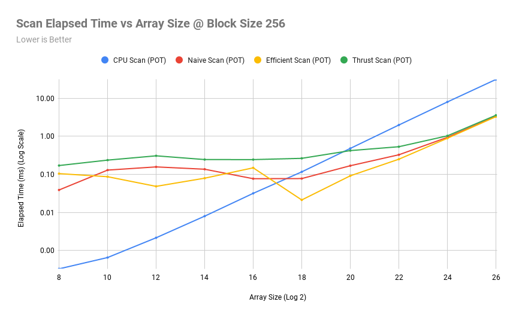

CUDA Stream Compaction
======================

**University of Pennsylvania, CIS 565: GPU Programming and Architecture, Project 2**

* Rahul Aggarwal
  * [LinkedIn](https://www.linkedin.com/in/rahul-aggarwal-32133a1b3/)
* Tested on: Ubuntu 20.04, i7-12700H @ 2.3GHz, RTX 3050 Ti Laptop 4GB (Personal)

### Overview

A CUDA Implementation of the parallel prefix sum algorithms and one of the use-cases, stream compaction. Scan algorithms were implemented on the cpu as well as the gpu for comparison. The GPU scan algorithms use the recursive scan approach to handle arbitrarily sized arrays.

### Performance Analysis

Before, we begin there are some important things to note. First, we remove ALL memory allocations from timing considerations. This means for our recursively scanning algorithm, we 

#### Block Size Optimization

To optimize for block size, we hold the array size constant at $2^26$ elements and test different block sizes in the range $\{32, 64, 128, 256, 512, 1024\}$. Below, we show the associated graph.


Here, we see that performance is best at block size 256, with performance drops both as we decrease and incerease the block size. Because we use a shared memory implementation, we can assume a tradeoff between how many blocks can be loaded per SM as we increase per-block shared memory requirements and the increased paralellism as we increase block size. 256 happens to be a sweet spot.

#### Scan Algorithm Comparison

To compare algorithm performance, we hold the block size constant at 256 and test array sizes in the range $\{2^8, 2^{10}, 2^{12}, 2^{14}, 2^{16}, 2^{18}, 2^{20}, 2^{22}, 2^{24}, 2^{26}, 2^{28}\}$. Below, we show the associated graph with a log-log scale.



There are some interesting things to talk about here. Firstly, the reason we can even come close to matching the thrust algorithm performance on paper is because we are NOT including the memory allocation time for the block sums needed for the recursive scan algorithm within our benchmarks. Because we don't have access to thrust code, any allocations they do are included within the performance characteristics. Therefore, we still are not as performant as the thrust implementation. However, I will say that the core logic of our approach is very sound and emulates what the thrust approach does as well, with the recursive scan block approach and using shared memory to both handle large arrays and be more efficient.

In addition, we notice that the GPU implementations finally become efficient around $2^{18}$ to $2^{20}$ elements, which will likely vary heavily across computers.

#### Extra Credit

I implemented the shared memory versions of both the naive and work-efficient versions of the scan algorithm, which allowed my GPU implementations to drastically improve on the CPU versions, especially as array sizes increase.
I thought about how I should interleave thread access to keep memory accesses consistent and get coalescing warp loads in order to heavily improve performance.
Unfortunately, I did not implement the non-shared memory versions of the algorithms, otherwise I would provide a performance comparison.

### Program Output

Here is a sample program output at $2^{26}$ elements and a block size of 256.

```
SIZE: 67108864
block_size: 256

****************
** SCAN TESTS **
****************
    [   3   7   3  40  37  22   3  35  31  37  11  39   8 ...  34   0 ]
==== cpu scan, power-of-two ====
   elapsed time: 31.9621ms    (std::chrono Measured)
    [   0   3  10  13  53  90 112 115 150 181 218 229 268 ... 1644167122 1644167156 ]
==== cpu scan, non-power-of-two ====
   elapsed time: 33.8643ms    (std::chrono Measured)
    [   0   3  10  13  53  90 112 115 150 181 218 229 268 ... 1644167098 1644167098 ]
    passed
==== naive scan, power-of-two ====
   elapsed time: 3.4007ms    (CUDA Measured)
    passed
==== naive scan, non-power-of-two ====
   elapsed time: 3.33414ms    (CUDA Measured)
    passed
==== work-efficient scan, power-of-two ====
   elapsed time: 3.30931ms    (CUDA Measured)
    passed
==== work-efficient scan, non-power-of-two ====
   elapsed time: 3.28806ms    (CUDA Measured)
    passed
==== thrust scan, power-of-two ====
   elapsed time: 3.8015ms    (CUDA Measured)
    passed
==== thrust scan, non-power-of-two ====
   elapsed time: 3.40358ms    (CUDA Measured)
    passed

*****************************
** STREAM COMPACTION TESTS **
*****************************
    [   0   3   0   1   2   0   1   1   2   2   1   0   3 ...   0   0 ]
==== cpu compact without scan, power-of-two ====
   elapsed time: 125.484ms    (std::chrono Measured)
    [   3   1   2   1   1   2   2   1   3   2   3   1   2 ...   3   1 ]
    passed
==== cpu compact without scan, non-power-of-two ====
   elapsed time: 126.557ms    (std::chrono Measured)
    [   3   1   2   1   1   2   2   1   3   2   3   1   2 ...   2   3 ]
    passed
==== cpu compact with scan ====
   elapsed time: 191.868ms    (std::chrono Measured)
    [   3   1   2   1   1   2   2   1   3   2   3   1   2 ...   3   1 ]
    passed
==== work-efficient compact, power-of-two ====
   elapsed time: 9.29174ms    (CUDA Measured)
    [   3   1   2   1   1   2   2   1   3   2   3   1   2 ...   3   1 ]
    passed
==== work-efficient compact, non-power-of-two ====
   elapsed time: 9.26003ms    (CUDA Measured)
    [   3   1   2   1   1   2   2   1   3   2   3   1   2 ...   2   3 ]
    passed
```