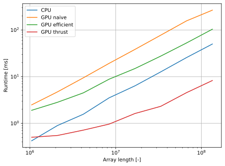

Project 2 Stream Compaction
===========================

**University of Pennsylvania, CIS 5650: GPU Programming and Architecture**

* Dominik Kau ([LinkedIn](https://www.linkedin.com/in/dominikkau/))
* Tested on: Windows 10, i7-12700 @ 2.10 GHz, 32 GB, T1000 4096 MB (CETS machine)

## Scan and Stream Compaction

Scan is an algorithm that outputs an array in which all previous elements of the input array have been summed up (https://en.wikipedia.org/wiki/Prefix_sum).
Stream compaction outputs an array that contains only those elements of the input that fulfill some predicate (in this project being non-zero).
The parallel implementation of stream compaction in this project will make use of the scan algorithm.

This project contains 4 implementations of the scan algorithm:
* straight-forward implementation on the CPU (CPU)
* naive, parallel implementation on the GPU (GPU naive)
* work-efficient implementation on the GPU (GPU efficient)
* implementation using the thrust library (GPU thrust)

The stream compaction algorithm is implemented in 3 variants:
* straight-forward implementation on the CPU (CPU)
* scan based implementation on the CPU
* work-efficient scan based implementation on the GPU (GPU)

These cases are labeled in the following graphs by the identifiers given in parentheses.
All implementations were tested on array lengths that are powers of 2 and on array lengths that are not powers of 2.
As far as I understand Part 5, Extra Credit, I implemented the alluded optimization by starting only as many threads as are needed (up to the block size) in every round of the algorithm.

## Performance Analysis

### Scan timings on arrays with sizes that are powers of 2



Surprisingly, the CPU implementation is quicker than both of my GPU implementations.
This is despite the fact, that for both GPU implementations, I am launching kernels only with as many threads as are needed (up to the block size).
This prevents starting many threads that will not be active after a first if-condition.
This result might be due to the usage of a CETS machine.

Unfortunately, I haven't been able to make a detailed performance analysis using the Nsight suite, but obviously the memory access pattern is suboptimal.
Firstly, using global memory will lead to high latencies in each kernel call.
Secondly the strided indexing pattern in both GPU implementations has the same performance as random access of memory which creates a big bottleneck.

Those bottlenecks are not present in the thrust implementation which is by far the fastest.

### Scan timings on arrays with sizes that are not powers of 2


The performance on arrays with non-powers of 2 lengths reflects the same trends as the results above.
Interestingly, for smaller arrays the thrust implementation is quite a bit quicker in this scenario than in the above case of arrays with lengths of power 2.

### Timing results of compacting algorithm


For the compacting algorithm, the GPU implementation is actually faster for large array sizes.
Here, only the straight-forward CPU implementation is used, as it is faster than the scan based algorithm.
I would have expected bigger differences between the two GPU and the CPU implementation, but again, the surprisingly short CPU runtime could stem from the fact that I am using a CETS machine.
There is not a big difference between the arrays with power of 2 lengths and those with non-power of 2 lengths.


## Console Output

This is the console output after running the project with an array size of $2^{20} = 1048576$.
I removed the numeric outputs for clarity.

```
****************
** SCAN TESTS **
****************
==== cpu scan, power-of-two ====
   elapsed time: 0.4223ms    (std::chrono Measured)
==== cpu scan, non-power-of-two ====
   elapsed time: 0.3906ms    (std::chrono Measured)
    passed
==== naive scan, power-of-two ====
   elapsed time: 2.48595ms    (CUDA Measured)
    passed
==== naive scan, non-power-of-two ====
   elapsed time: 2.34307ms    (CUDA Measured)
    passed
==== work-efficient scan, power-of-two ====
   elapsed time: 1.90022ms    (CUDA Measured)
    passed
==== work-efficient scan, non-power-of-two ====
   elapsed time: 1.82384ms    (CUDA Measured)
    passed
==== thrust scan, power-of-two ====
   elapsed time: 0.503264ms    (CUDA Measured)
    passed
==== thrust scan, non-power-of-two ====
   elapsed time: 0.183776ms    (CUDA Measured)
    passed

*****************************
** STREAM COMPACTION TESTS **
*****************************
==== cpu compact without scan, power-of-two ====
   elapsed time: 2.1741ms    (std::chrono Measured)
    passed
==== cpu compact without scan, non-power-of-two ====
   elapsed time: 2.1809ms    (std::chrono Measured)
    passed
==== cpu compact with scan ====
   elapsed time: 3.3442ms    (std::chrono Measured)
    passed
==== work-efficient compact, power-of-two ====
   elapsed time: 3.5247ms    (CUDA Measured)
    passed
==== work-efficient compact, non-power-of-two ====
   elapsed time: 3.73046ms    (CUDA Measured)
    passed
```
