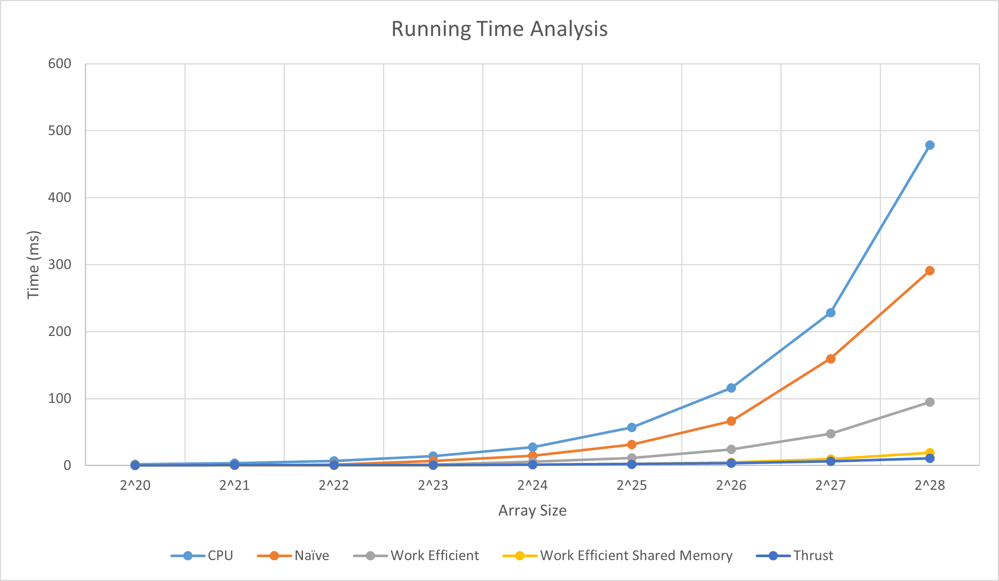

CUDA Stream Compaction
======================

**University of Pennsylvania, CIS 565: GPU Programming and Architecture, Project 2**

* Mengxuan Huang
  * [LinkedIn](https://www.linkedin.com/in/mengxuan-huang-52881624a/)
* Tested on: Windows 11, i9-13980HX @ 2.22GHz 64.0 GB, RTX4090-Laptop 16384MB

# Features
- CPU Scan
- CPU Compact
- GPU Scan Naive
- GPU Scan Efficient (Binary Balanced Tree)
- GPU Compact (use GPU effcient Scan)
- GPU Radix Sort (use GPU effcient Scan)

# GPU Radix Sort
Expect for GPU scan and GPU compact, I also implemented GPU sort using radix sort method. The algorithm iterates from the lowest bit to highest bit and sort numbers based on the the binary value of the bit in current iteration.  


I also implement two optimizations:
- Check whether to skip this iteration
- Check whether all numbers are sorted and we can stop sorting


It is noticed that to keep the scale of y-axis reasonable, I did not include $2^{24}$ data of CPU method in the graph.

The line graph shows that CPU sort is faster than any GPU methods when the number is small. But GPU methods perform much better when number keep increasing. Besides, the performance of Radix sort with optimization is better than the radix sort without optimization.

# Analysis (Unoptimized)

| Block Size |
|-----------|
|   32      |



It is noticed that to keep the scale of y-axis reasonable, I did not include $2^{24}$ data, which are over 10ms, of CPU method and GPU native in the graph.

According to the test result, CPU scan methods (looping) perform better than any GPU scan methods when the number of element is small. When the number of element increase, GPU methods require less time to finish scanning.

For the number of block, I only luanch neceeesary threads in both the naive scan method and the efficient scan method.
- In the naive scan method, only $n - 2^d$ threads needed for each iteration.
- In the up-sweep in the efficient scan method, $n / 2^{d+1}$ threads needed.
- In the down-sweep in the efficient scan method, $2^d$ threads needed.

## Block Size
Test on $2^{20}$ elements. Run 1000 times and compute the average run time.


According to the line graph, the efficient method get best performance at $block size = 1024$, and the naive method get best performance at $block size = 1024$ as well.

Although I run 1000 times and compute the average run time, I can still get different best block size when I run again. I guess this might because data distribution will also affect the perfermance as well.

Finally, I guess that the perfermance are best when $block size \geq 32$.

## Compare
| Block Size |
|-----------|
|   128      |


It is noticed that to keep the scale of y-axis reasonable, I did not include $2^{24}$ data, which are over 10ms, of CPU method and GPU native in the graph.

According to the graph, the CPU method performs better for small number of data, while GPU method run much faster for large amount of data. When $n = 2^20$, my efficient scan run almost as fast as thrust library. But thrust library is much faster when the amount data keep increasing.

### What thrust::exclusive_scan Do


The above imamge shown thrust::exclusive_scan firstly luanch *DeviceScanInitKernel* and then the *DeviceScanKernel*, which means it finishes the scan in just two step, which is much more efficient than my "Efficient" scan!
- In the *DeviceScanInitKernel*, it must finish GPU allocation and data copy from Host(CPU) to Device(GPU).
- In the *DeviceScanKernel*, it finish the exclusive scan.

## Bottlenecks

The bottlenecks comes from the memory throughtput as shown in the image. This is the same in both naive method and the efficient method.

## Output of a test
```
SM: 76
Warp Size: 32
Max Threads/Block Size: 1024
Max Block/SM: 24
Max Wave: 1824
    [  29  17  49  36   3  14  10  16  43  47  28  21   8 ...  27   0 ]

****************
** SCAN TESTS **
****************
==== thrust scan, power-of-two ====
   elapsed time: 1.07789ms    (CUDA Measured)
    [   0  29  46  95 131 134 148 158 174 217 264 292 313 ... 410868819 410868846 ]
==== thrust scan, non-power-of-two ====
   elapsed time: 1.05686ms    (CUDA Measured)
    [   0  29  46  95 131 134 148 158 174 217 264 292 313 ... 410868712 410868730 ]
    passed
==== cpu scan, power-of-two ====
   elapsed time: 21.9401ms    (std::chrono Measured)
    [   0  29  46  95 131 134 148 158 174 217 264 292 313 ... 410868819 410868846 ]
==== cpu scan, non-power-of-two ====
   elapsed time: 24.0604ms    (std::chrono Measured)
    [   0  29  46  95 131 134 148 158 174 217 264 292 313 ... 410868712 410868730 ]
    passed
==== naive scan, power-of-two ====
   elapsed time: 13.0793ms    (CUDA Measured)
    [   0  29  46  95 131 134 148 158 174 217 264 292 313 ... 410868819 410868846 ]
    passed
==== naive scan, non-power-of-two ====
   elapsed time: 12.9254ms    (CUDA Measured)
    [   0  29  46  95 131 134 148 158 174 217 264 292 313 ...   0   0 ]
    passed
==== work-efficient scan, power-of-two ====
   elapsed time: 2.50429ms    (CUDA Measured)
    [   0  29  46  95 131 134 148 158 174 217 264 292 313 ... 410868819 410868846 ]
    passed
==== work-efficient scan, non-power-of-two ====
   elapsed time: 2.21098ms    (CUDA Measured)
    [   0  29  46  95 131 134 148 158 174 217 264 292 313 ... 410868712 410868730 ]
    passed

*****************************
** STREAM COMPACTION TESTS **
*****************************
==== cpu compact without scan, power-of-two ====
   elapsed time: 8.4759ms    (std::chrono Measured)
    [  29  17  49  36   3  14  10  16  43  47  28  21   8 ...  43  27 ]
    passed
==== cpu compact without scan, non-power-of-two ====
   elapsed time: 7.2072ms    (std::chrono Measured)
    [  29  17  49  36   3  14  10  16  43  47  28  21   8 ...  18  46 ]
    passed
==== cpu compact with scan ====
   elapsed time: 42.8932ms    (std::chrono Measured)
    [  29  17  49  36   3  14  10  16  43  47  28  21   8 ...   2  18 ]
    expected 16441514 elements, got 16441511
    FAIL COUNT
==== work-efficient compact, power-of-two ====
   elapsed time: 3.55958ms    (CUDA Measured)
    [  29  17  49  36   3  14  10  16  43  47  28  21   8 ...  43  27 ]
    passed
==== work-efficient compact, non-power-of-two ====
   elapsed time: 4.56838ms    (CUDA Measured)
    [  29  17  49  36   3  14  10  16  43  47  28  21   8 ...  18  46 ]
    passed

*****************************
** SORT TESTS **
*****************************
==== CPU sort, power-of-two ====
   elapsed time: 255.996ms    (std::chrono Measured)
==== CPU sort, non-power-of-two ====
   elapsed time: 241.058ms    (std::chrono Measured)
==== Thrust sort, power-of-two ====
   elapsed time: 5.74099ms    (CUDA Measured)
==== Radix sort, power-of-two ====
   elapsed time: 21.6387ms    (CUDA Measured)
    [   0   0   0   0   0   0   0   0   0   0   0   0   0 ...  49  49 ]
    passed
==== Thrust sort, non-power-of-two ====
   elapsed time: 4.88704ms    (CUDA Measured)
==== Radix sort, non-power-of-two ====
   elapsed time: 31.1871ms    (CUDA Measured)
    [   0   0   0   0   0   0   0   0   0   0   0   0   0 ...  49  49 ]
    passed
```