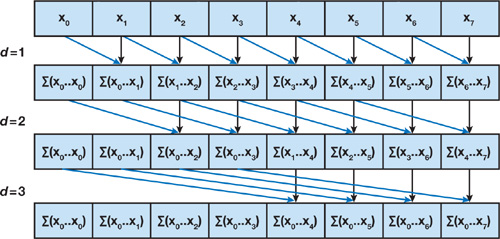
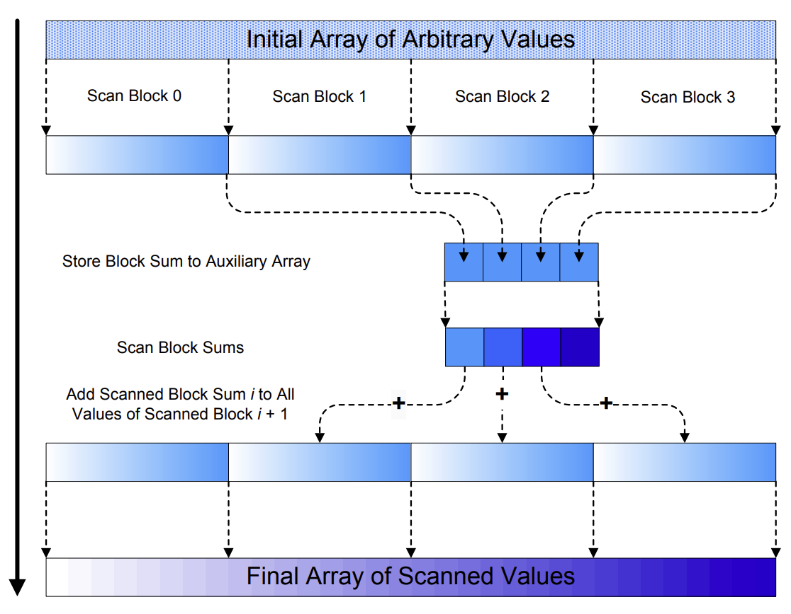

CUDA Stream Compaction
======================

**University of Pennsylvania, CIS 565: GPU Programming and Architecture, Project 2**

* Zhiyi Zhou
* Tested on: Windows 11, i9-13900H @ 2.6GHz 64GB, RTX4060 Laptop

## **Features**
### 1. CPU Scan & Compact

### 2. Naive Scan


### 3. Work-Efficient GPU Scan & Stream Compaction
- **Up-Sweep**

1: **for** $d = 0$ to $log_2(n – 1)$ **do**
2: **for all** $k = 0$ to $ n – 1 $ by $2^{d+1}$ in parallel **do**
3: $x[k + 2^{d+1} – 1] = x[k + 2^d – 1] + x[k + 2^{d +1} – 1]$
<br>

- **Down-Sweep**

1: $x[n – 1] = 0$
2: **for** $d = log_2(n – 1)$ down to $0$ **do**
3: **for all** $k = 0$ to $n – 1$ by $2^{d} + 1$ in parallel **do**
4: $t = x[k + 2^d – 1]$
5: $x[k + 2^d – 1] = x[k + 2^{d +1} – 1]$
6: $x[k + 2^{d +1} – 1] = t + x[k + 2^{d +1} – 1]$
- **Compaction**
    Implemented `StreamCompaction::Common::kernMapToBoolean` and `StreamCompaction::Common::kernScatter`. I use exclusive scan to determine non-zero elements' position in the output buffer.

### 4. Work Efficient Method Optimization With Shared Memory (Extra Credit)
[Parallel Prefix Sum (Scan) with CUDA](https://developer.download.nvidia.com/compute/cuda/1.1-Beta/x86_website/projects/scan/doc/scan.pdf)
[Correspoding Chapter in GPU Gems3](https://developer.nvidia.com/gpugems/gpugems3/part-vi-gpu-computing/chapter-39-parallel-prefix-sum-scan-cuda)

- **Algorithm**
  
  Break the whole array into many fixed-length blocks. For each data block, I use a block of threads to scan it. 
  In the kernel function, the first step is to fetch data from global memory into the block's shared memory to minimize memory latency and enhance performance. Since each block processes its own independent data block, this operation remains data-isolated across blocks.
  Additionally, we use a sum array to record the total sum of each block, allowing us to ultimately compute the cumulative sum starting from the first element.
- **Bank Conflict**
  
  

  ```
  #define CONFLICT_FREE_OFFSET(n) ((n) >> LOG_NUM_BANKS)
  // Up-Sweep
  int ai = offset * ((thid << 1) + 1) - 1;
  int bi = offset * ((thid << 1) + 2) - 1;
  ai += CONFLICT_FREE_OFFSET(ai);
  bi += CONFLICT_FREE_OFFSET(bi);

  s_out[bi] += s_out[ai];
  ```

### Radix Sort


## Questions
### Compare all of these GPU Scan implementations


## Sample Output
```
****************
** SCAN TESTS **
****************
    [   9  28  17  15   5  21   4   9  14  37  18   9  38 ...  35   0 ]
==== cpu scan, power-of-two ====
   elapsed time: 111.3ms    (std::chrono Measured)
    [   0   9  37  54  69  74  95  99 108 122 159 177 186 ... 1643563570 1643563605 ]
==== cpu scan, non-power-of-two ====
   elapsed time: 113.37ms    (std::chrono Measured)
    [   0   9  37  54  69  74  95  99 108 122 159 177 186 ... 1643563480 1643563509 ]
    passed
==== naive scan, power-of-two ====
   elapsed time: 69.1429ms    (CUDA Measured)
    [   0   9  37  54  69  74  95  99 108 122 159 177 186 ... 1643563570 1643563605 ]
    passed
==== naive scan, non-power-of-two ====
   elapsed time: 69.2391ms    (CUDA Measured)
    [   0   9  37  54  69  74  95  99 108 122 159 177 186 ... 1643563480 1643563509 ]
    passed
==== work-efficient scan, power-of-two ====
   elapsed time: 25.2686ms    (CUDA Measured)
    [   0   9  37  54  69  74  95  99 108 122 159 177 186 ... 1643563570 1643563605 ]
    passed
==== work-efficient scan, non-power-of-two ====
   elapsed time: 24.3904ms    (CUDA Measured)
    [   0   9  37  54  69  74  95  99 108 122 159 177 186 ... 1643563480 1643563509 ]
    passed
==== work-efficient optimized scan, power-of-two ====
   elapsed time: 5.13843ms    (CUDA Measured)
    [   0   9  37  54  69  74  95  99 108 122 159 177 186 ... 1643563570 1643563605 ]
    passed
==== work-efficient optimized scan, non-power-of-two ====
   elapsed time: 4.93773ms    (CUDA Measured)
    [   0   9  37  54  69  74  95  99 108 122 159 177 186 ... 1643563480 1643563509 ]
    passed
==== thrust scan, power-of-two ====
   elapsed time: 3.3577ms    (CUDA Measured)
    [   0   9  37  54  69  74  95  99 108 122 159 177 186 ... 1643563570 1643563605 ]
    passed
==== thrust scan, non-power-of-two ====
   elapsed time: 3.49398ms    (CUDA Measured)
    [   0   9  37  54  69  74  95  99 108 122 159 177 186 ... 1643563480 1643563509 ]
    passed

*****************************
** STREAM COMPACTION TESTS **
*****************************
    [   1   1   0   1   3   2   0   3   1   1   0   3   1 ...   2   0 ]
==== cpu compact without scan, power-of-two ====
   elapsed time: 142.905ms    (std::chrono Measured)
    [   1   1   1   3   2   3   1   1   3   1   1   1   1 ...   3   2 ]
    passed
==== cpu compact without scan, non-power-of-two ====
   elapsed time: 130.881ms    (std::chrono Measured)
    [   1   1   1   3   2   3   1   1   3   1   1   1   1 ...   1   3 ]
    passed
==== cpu compact with scan ====
   elapsed time: 229.093ms    (std::chrono Measured)
    [   1   1   1   3   2   3   1   1   3   1   1   1   1 ...   3   2 ]
    passed
==== work-efficient compact, power-of-two ====
   elapsed time: 34.0861ms    (CUDA Measured)
    [   1   1   1   3   2   3   1   1   3   1   1   1   1 ...   3   2 ]
    passed
==== work-efficient compact, non-power-of-two ====
   elapsed time: 33.6979ms    (CUDA Measured)
    [   1   1   1   3   2   3   1   1   3   1   1   1   1 ...   1   3 ]
    passed
==== work-efficient compact optimized, power-of-two ====
   elapsed time: 15.0292ms    (CUDA Measured)
    [   1   1   1   3   2   3   1   1   3   1   1   1   1 ...   3   2 ]
    passed
==== work-efficient compact optimized, non-power-of-two ====
   elapsed time: 15.9734ms    (CUDA Measured)
    [   1   1   1   3   2   3   1   1   3   1   1   1   1 ...   1   3 ]
    passed

*****************************
** RAIX SORT TESTS **
*****************************
    [  73  54  88  65  45  60   4   0  25  13  76  35  40 ...  17   0 ]
==== cpu quick sort without scan, power-of-two ====
   elapsed time: 1433.53ms    (std::chrono Measured)
    [   0   0   0   0   0   0   0   0   0   0   0   0   0 ...  99  99 ]
    passed
==== gpu radix sort with shared mem optimized scan, power-of-two ====
   elapsed time: 120.031ms    (CUDA Measured)
    [   0   0   0   0   0   0   0   0   0   0   0   0   0 ...  99  99 ]
    passed
```