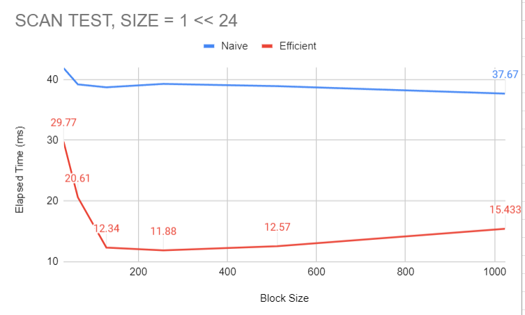
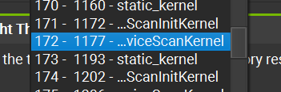
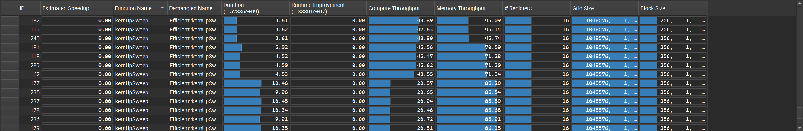
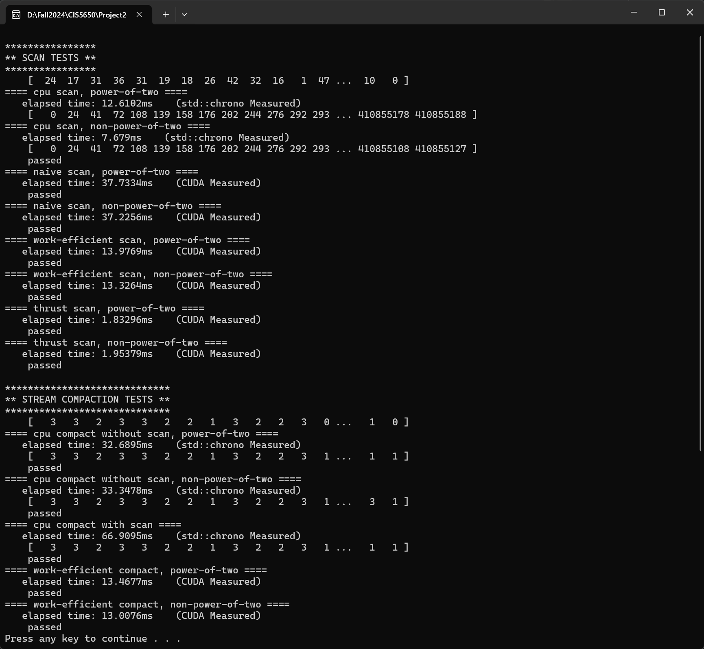

# 565hw2

Owner: Andy Wang
Tags: CG General

### Features Implemented

1. CPU Scan & Stream Compaction
2. Naive GPU Scan Algorithm
3. Work-Efficient GPU Scan & Stream Compaction
4. Thrust Implementation

### Results

**Optimized Block Size:**

For different GPU scan implementations, applying different block size will achieve different performance. As indicated in the graph, the optimized block size of **Naive scan method** could be **1024**, and for **Work-Efficient method** it could be **256**

**Scan Methods Performance Comparison**

When dealing with array size less than 2^24, the difference is subtle between different methods. But as scan size increase exponentially, thrust implementations **out-performs** the CPU implementation at array size equals **2^24.** 

**Compact Methods Performance Comparison**

The results from compact test is similar from what we had in scan test, where GPU implementation **out-performs** CPU implementation at array size equals **2^24.**

**What does thrust do?**

By checking Nsight Compute, we can observe that Thrust implementation only take 2 step to finish the scan algorithm. The allocation and utilization of grid size and registers is much different from my implementation.

**Bottleneck**

Comparing with the above shown results from Thrust implementation, there are lots of software calls in my algorithm. The ballance between compute throughput and memory thoughput is not optimized. A potential solution might be to implement this algorithm using shared memory to reduce memory throughput.

**Result**

Optimized Block Size, Array Size of $2^{24}$

